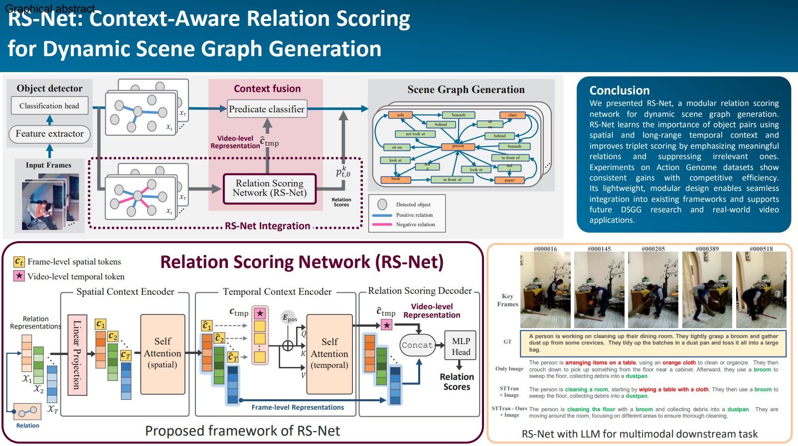
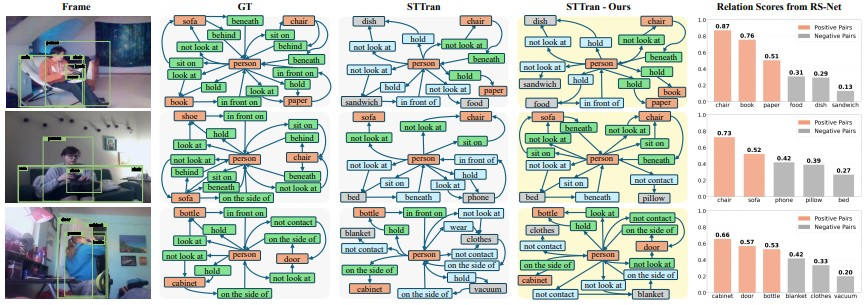
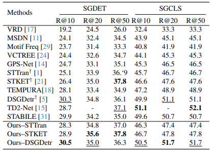
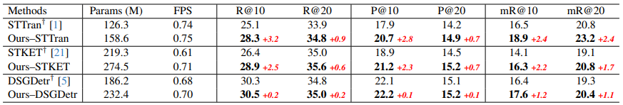

# RS-Net: Dynamic Scene Graph Generation을 위한 Relation Scoring Network

🚀 본 레포지토리는 **RS-Net (Relation Scoring Network)**의 공식 구현입니다.  
RS-Net은 Dynamic Scene Graph Generation(DSGG)에서 **의미 있는 관계를 효과적으로 선별**하기 위한 모듈형 네트워크입니다.

---

## 📌 개요 (Overview)

Dynamic Scene Graph Generation(DSGG)은 비디오에서 시간에 따라 변화하는 객체 간 관계를 모델링하는 작업입니다.

하지만 기존 방법들은 다음과 같은 한계를 가집니다:

- **학습 단계**: annotation이 있는 객체 쌍만 사용
- **추론 단계**: 모든 객체 쌍에 대해 관계 예측 수행

👉 이로 인해 **의미 없는 관계까지 예측되는 문제**가 발생합니다.

---

## 💡 제안 방법: RS-Net

RS-Net은 이러한 문제를 해결하기 위해:

- 객체 간 관계의 **중요도를 명시적으로 학습**
- **positive / negative 관계 모두 활용**
- **공간 + 시간적 컨텍스트를 함께 반영**
- 기존 DSGG 모델에 **쉽게 결합 가능**

한 Relation Scoring Network입니다.

---

## 🧠 주요 기여 (Key Contributions)

- 🔹 관계의 중요도를 명시적으로 학습하는 **Relation Scoring 구조**
- 🔹 Transformer 기반의 **공간 + 시간 컨텍스트 모델링**
- 🔹 **negative relation까지 활용**한 학습 방식
- 🔹 기존 DSGG 모델에 **plug-and-play 형태로 통합 가능**
- 🔹 동적 장면에서의 **관계 이해 성능 향상**

---

## 🏗️ 모델 구조 (Method Overview)

RS-Net은 다음 3가지 주요 구성 요소로 이루어집니다:

### 1. Spatial Context Encoder
- 동일 프레임 내 관계 간 상호작용 모델링
- Transformer self-attention 사용
- learnable spatial token 도입

### 2. Temporal Context Encoder
- 전체 비디오에서 장기 temporal dependency 학습
- Transformer + positional encoding
- video-level context token 생성

### 3. Relation Scoring Decoder
- 각 관계의 중요도를 확률로 출력
- (의미 있음 / 없음) **2-class 분류**
- relation ranking 가능

---

## 🔌 모델 통합 (Integration)

RS-Net은 기존 DSGG 프레임워크에 쉽게 결합됩니다:

- relation feature에 **temporal context 주입**
- relation score를 **predicate classification에 반영**
- end-to-end 학습 가능

---

## 🖼️ Graphical Abstract



---

## 📊 결과 (Results)

### ✔ Qualitative Results


RS-Net은 의미 있는 객체 관계를 더 잘 포착하고, 불필요한 관계를 효과적으로 제거합니다.

---

### ✔ Quantitative Results

#### Table 1


#### Table 2


- Action Genome 데이터셋에서 성능 향상
- SGDET task에서 효율성과 정확도 개선

---

## ⚙️ 설치 방법 (Installation)

```bash
git clone https://github.com/your-repo/rs-net.git
cd rs-net
pip install -r requirements.txt